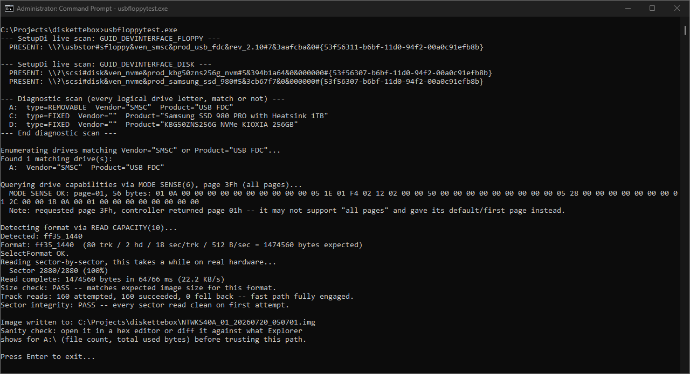

<p align="center">
  
</p>

# DisketteBox

**A Windows floppy-image organizer that treats a software set as a set, not as a pile of anonymous `.img` files.**

DisketteBox is a Delphi application for cataloging, inspecting, mounting, reading, and eventually writing floppy-disk images. The goal is to make a digital collection behave more like the physical diskette boxes it replaced: grouped, labeled, searchable, and available on demand.

> A raw image preserves the bytes. DisketteBox also preserves what the disk belonged to.

## Current status

DisketteBox is under active redevelopment.

The physical-drive code is being validated in a small standalone harness before it is backported into the main application. This keeps hardware testing isolated, repeatable, and far less likely to damage the catalog or UI code while the transport layer is still changing.

There is no stable public release yet.

| Area | Status |
| --- | --- |
| Disk-set catalog and metadata | Prototype working |
| Raw image handling | Working |
| Read-only mounting through Windows | Working in the development build |
| **Create Image from Disk** | Standalone USB-FDD validation in progress |
| **Create Disk from Image** | Write path implemented; destructive hardware validation pending |
| Installer and public release | Not yet |

## What makes it different

### Disk sets are first-class objects

Many archived programs span several disks. DisketteBox keeps those disks together with set-level and disk-level metadata instead of reducing the collection to filenames in a directory.

The catalog model can retain information such as:

- Title, publisher, year, platform, category, and description
- Disk order and labels
- Image paths
- CRC32 and additional verification hashes
- Notes, source, contributor, language, format, and media type

### Raw images can become real Windows volumes

The development build can place a raw floppy image inside a fixed VHD and attach it through the Windows Virtual Disk API.

Windows then sees the image as a mounted block device and can expose a valid FAT volume through Explorer and ordinary file APIs. DisketteBox does not need to ship a custom filesystem browser or kernel-mode floppy emulator merely to let the user inspect files.

The image is mounted read-only.

### Physical USB floppy support

DisketteBox is gaining direct physical-media support through Windows SCSI Pass Through Direct (SPTI).

The current reader:

- Identifies supported USB floppy devices
- Detects 720 KB and 1.44 MB geometry
- Reads a complete track with one multi-block `READ(10)` command
- Falls back to individual sectors when a track cannot be read cleanly
- Records transport, retry, fallback, and bad-sector information
- Writes a raw sector-for-sector image

The standalone write path will be validated against disposable media before it is allowed near irreplaceable disks.

## First real speed result



A clean 1.44 MB disk was read through an SMSC-based Samsung USB FDC in:

```text
1,474,560 bytes in 64,766 ms
160 track reads attempted
160 track reads succeeded
0 track fallbacks
2,880 sectors read cleanly on the first attempt
```

That is roughly **ten times faster than WinImage in the current hardware test**.

The drive has not become faster. It still rotates at 300 RPM. The improvement comes from asking for an entire track at once instead of issuing 2,880 separate one-sector commands and repeatedly surrendering rotational position between requests.

This result is promising, but it is still an early hardware result rather than a universal performance claim.

## Hardware validation

Current testing uses:

- Samsung SFD-321U / SMSC `USB FDC`
- 44 rescued 1.44 MB diskettes reserved for development and destructive testing
- Windows 11
- Direct access by drive letter through SPTI

A Dell MultiBay floppy drive with its external USB connection will be used as the next independent controller test. The goal is to determine whether track-sized reads are broadly supported or whether chunk sizing must be negotiated per bridge.

## Planned workflow

### Create Image from Disk

1. Identify the USB floppy controller.
2. Detect and validate disk geometry.
3. Select the largest safe transfer size.
4. Read sequentially in batches.
5. Split or fall back around weak sectors.
6. Save the raw image and a detailed recovery report.
7. Optionally mount the completed image read-only.

### Create Disk from Image

1. Validate the exact image size and geometry.
2. Require an explicit destructive-write confirmation.
3. Write the disk in safe batches.
4. Read the media back.
5. Compare every sector with the source image.
6. Report any mismatch or transport failure without pretending the disk is good.

## Safety

The current physical-drive work is development code.

Do not use an unvalidated build to write valuable media. Transport failures, unplugged hardware, write protection, unsupported commands, weak sectors, and partial transfers must all be handled distinctly before the write feature is considered release-ready.

Read testing began with archival safety in mind. Write testing is being performed only on media that was rescued from disposal and will never be sold or represented as reliable storage.

## Screenshots and hardware photographs

The [`images`](images/) folder contains interface captures, diagnostic evidence, and hardware setup photographs. Each image should answer a useful question: what worked, how it was connected, what the application displayed, or what hardware was actually tested.

## Development direction

The immediate goal is not to turn DisketteBox into a full machine emulator.

It is intended to become a focused Windows tool for:

- Managing floppy-image collections
- Keeping multi-disk releases together
- Mounting images through the native Windows storage stack
- Creating verified images from physical disks
- Writing images back to disposable or replacement media
- Recording enough metadata and diagnostics that the result can be trusted later

The standalone USB-FDD work will be merged only after the read and write paths survive real hardware, bad media, interrupted operations, and a second USB controller.
